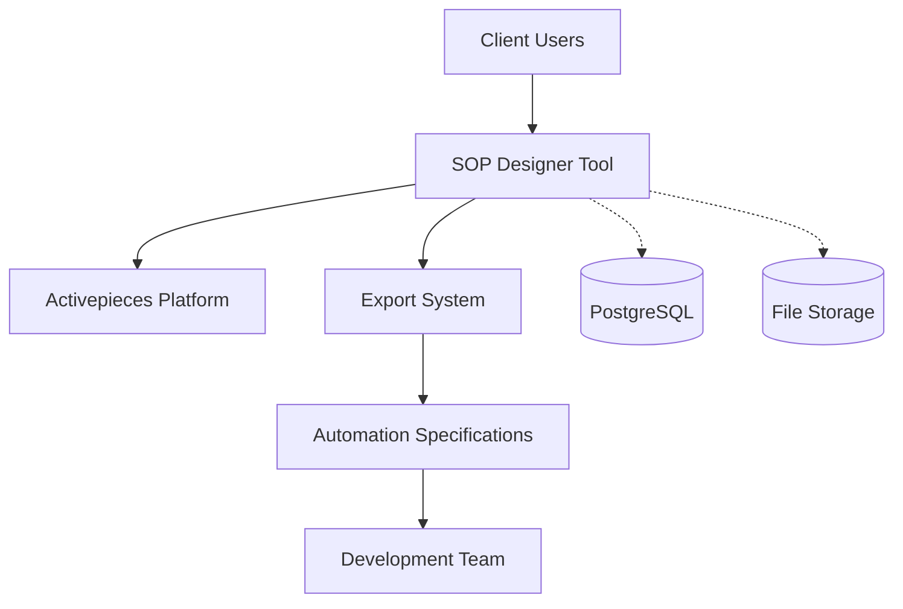

# System Architecture Overview

## High-Level Architecture

### System Context


### Component Architecture
```
SOP Designer Tool
├── Frontend Layer (Angular)
│   ├── SOP-Specific UI Components
│   ├── Custom Theming & Branding  
│   └── Export Interface
├── Backend Layer (NestJS)
│   ├── Custom SOP Pieces
│   ├── Export API Endpoints
│   └── Client Management
├── Data Layer
│   ├── PostgreSQL Database
│   └── File Storage System
└── Infrastructure
    ├── Docker Containers
    └── Reverse Proxy
```

## Detailed Component Design

### 1. Frontend Layer Architecture

#### Core Angular Structure
```typescript
src/app/
├── modules/
│   ├── sop/                          // NEW: SOP-specific module
│   │   ├── components/
│   │   │   ├── sop-designer/         // Main SOP design interface
│   │   │   ├── sop-navbar/           // Custom navigation
│   │   │   ├── sop-pieces-palette/   // SOP workflow pieces
│   │   │   ├── sop-canvas/           // Workflow canvas
│   │   │   └── sop-export/           // Export interface
│   │   ├── services/
│   │   │   ├── sop-terminology.service.ts
│   │   │   ├── sop-export.service.ts
│   │   │   └── sop-validation.service.ts
│   │   └── models/
│   │       └── sop.models.ts
│   ├── flow-builder/                 // MODIFIED: Original workflow builder
│   │   ├── components/ (customized)
│   │   └── services/ (extended)
│   └── common/                       // MODIFIED: Shared components
│       ├── components/navbar/ (customized)
│       └── services/navigation.service.ts (extended)
├── assets/sop/                       // NEW: SOP-specific assets
│   ├── logos/
│   ├── icons/
│   └── templates/
└── styles/sop/                       // NEW: SOP theming
    ├── sop-theme.scss
    └── sop-components.scss
```

#### Component Interaction Flow
```typescript
// Client interaction flow:
SopNavbarComponent -> 
  SopDesignerComponent -> 
    SopCanvasComponent -> 
      SopPiecesPaletteComponent -> 
        CustomSopPieces -> 
          SopExportComponent -> 
            ExportService
```

### 2. Custom SOP Pieces Architecture

#### Piece Framework Extension
```typescript
// Base SOP piece structure:
@Piece({
  displayName: 'SOP Process Step',
  description: 'Standard operating procedure step',
  logoUrl: '/assets/sop/icons/process-step.svg',
  version: '1.0.0',
  categories: ['sop', 'process']
})
export class SopProcessStepPiece {
  
  @PieceAction({
    displayName: 'Execute Process Step',
    description: 'Execute a standard process step'
  })
  static async executeStep(context: ActionContext<ProcessStepConfig>) {
    // Implementation
  }
}
```

#### SOP Piece Categories
```typescript
const sopPieceCategories = {
  process: [
    'ProcessStep',        // Basic procedure step
    'DecisionPoint',      // Conditional logic step
    'ParallelProcess'     // Concurrent process steps
  ],
  
  human: [
    'ApprovalGate',       // Human approval required
    'DataForm',           // Manual data entry
    'ReviewTask'          // Document/quality review
  ],
  
  integration: [
    'Notification',       // Email/Slack notifications  
    'DocumentStorage',    // File save/retrieve
    'SystemIntegration'   // External system calls
  ],
  
  compliance: [
    'ComplianceCheck',    // Regulatory validation
    'AuditLog',          // Compliance logging
    'QualityGate'        // Quality control check
  ]
};
```

### 3. Export System Architecture

#### Export Service Design
```typescript
@Injectable()
export class SopExportService {
  
  // Core export methods
  async exportToJson(sopId: string): Promise<SopSpecification> {
    const sop = await this.getSopDefinition(sopId);
    return this.convertToSpecification(sop);
  }
  
  async exportToPdf(sopId: string): Promise<Buffer> {
    const spec = await this.exportToJson(sopId);
    return this.generatePdfFromSpec(spec);
  }
  
  async exportToYaml(sopId: string): Promise<string> {
    const spec = await this.exportToJson(sopId);
    return yaml.dump(spec);
  }
}
```

#### Export Data Structure
```typescript
interface SopSpecification {
  metadata: {
    id: string;
    title: string;
    version: string;
    createdBy: string;
    createdAt: Date;
    updatedAt: Date;
    clientId: string;
  };
  
  process: {
    steps: ProcessStep[];
    decisions: DecisionPoint[];
    approvals: ApprovalGate[];
    integrations: Integration[];
    notifications: Notification[];
  };
  
  automationSpecs: {
    requirements: string[];
    dataModels: DataModel[];
    integrationEndpoints: IntegrationSpec[];
    businessRules: BusinessRule[];
    validationRules: ValidationRule[];
  };
  
  documentation: {
    processDescription: string;
    stepDetails: StepDocumentation[];
    roleResponsibilities: RoleDefinition[];
    complianceNotes: string[];
  };
}
```

### 4. Backend API Architecture

#### API Endpoint Structure
```typescript
// SOP-specific API endpoints:
@Controller('api/sop')
export class SopController {
  
  @Get(':id')
  async getSop(@Param('id') id: string) {
    // Get SOP definition
  }
  
  @Post()
  async createSop(@Body() sopData: CreateSopDto) {
    // Create new SOP
  }
  
  @Put(':id')
  async updateSop(@Param('id') id: string, @Body() sopData: UpdateSopDto) {
    // Update existing SOP
  }
  
  @Post(':id/export')
  async exportSop(@Param('id') id: string, @Body() options: ExportOptionsDto) {
    // Export SOP in various formats
  }
  
  @Get(':id/validate')
  async validateSop(@Param('id') id: string) {
    // Validate SOP for completeness
  }
}
```

#### Database Schema Extensions
```sql
-- Extend existing Activepieces schema:

-- SOP-specific metadata table
CREATE TABLE sop_metadata (
  id UUID PRIMARY KEY DEFAULT gen_random_uuid(),
  flow_id UUID REFERENCES flows(id),
  client_id VARCHAR(255) NOT NULL,
  sop_type VARCHAR(100) NOT NULL,
  industry VARCHAR(100),
  compliance_level VARCHAR(50),
  created_at TIMESTAMP DEFAULT NOW(),
  updated_at TIMESTAMP DEFAULT NOW()
);

-- SOP export history
CREATE TABLE sop_exports (
  id UUID PRIMARY KEY DEFAULT gen_random_uuid(),
  sop_id UUID REFERENCES sop_metadata(id),
  export_format VARCHAR(50) NOT NULL,
  export_data JSONB,
  exported_by UUID REFERENCES users(id),
  exported_at TIMESTAMP DEFAULT NOW()
);

-- SOP validation results
CREATE TABLE sop_validations (
  id UUID PRIMARY KEY DEFAULT gen_random_uuid(),
  sop_id UUID REFERENCES sop_metadata(id),
  validation_results JSONB,
  is_valid BOOLEAN,
  validated_at TIMESTAMP DEFAULT NOW()
);
```

### 5. Client Management Architecture

#### Multi-Client Workspace Design
```typescript
interface ClientWorkspace {
  clientId: string;
  brandingConfig: {
    logoUrl: string;
    primaryColor: string;
    secondaryColor: string;
    companyName: string;
  };
  
  sopTemplates: SopTemplate[];
  customPieces: string[];
  exportSettings: ExportConfiguration;
  users: ClientUser[];
}

@Injectable()
export class ClientManagementService {
  
  async setupClientWorkspace(clientConfig: ClientConfiguration): Promise<ClientWorkspace> {
    // Initialize client-specific workspace
  }
  
  async getClientBranding(clientId: string): Promise<BrandingConfig> {
    // Get client-specific branding
  }
}
```

### 6. Authentication and Authorization

#### Client-Scoped Security
```typescript
// Extend Activepieces auth with client scoping:
@Injectable()
export class SopAuthGuard extends AuthGuard {
  
  async canActivate(context: ExecutionContext): Promise<boolean> {
    const baseAuth = await super.canActivate(context);
    if (!baseAuth) return false;
    
    // Additional client-scope validation
    const request = context.switchToHttp().getRequest();
    const user = request.user;
    const clientId = request.params.clientId;
    
    return this.validateClientAccess(user.id, clientId);
  }
}
```

### 7. Infrastructure Architecture

#### Deployment Architecture
```yaml
# Docker Compose structure:
version: '3.8'
services:
  sop-frontend:
    build: ./packages/ui/frontend
    ports:
      - "4200:80"
    environment:
      - API_URL=http://sop-backend:3000
  
  sop-backend:
    build: ./packages/backend
    ports:
      - "3000:3000"
    environment:
      - DATABASE_URL=postgresql://user:pass@db:5432/sopdb
    depends_on:
      - db
      - redis
  
  db:
    image: postgres:15
    environment:
      POSTGRES_DB: sopdb
      POSTGRES_USER: user
      POSTGRES_PASSWORD: pass
    volumes:
      - postgres_data:/var/lib/postgresql/data
  
  redis:
    image: redis:7-alpine
    volumes:
      - redis_data:/data

volumes:
  postgres_data:
  redis_data:
```

## Data Flow Architecture

### 1. SOP Creation Flow
```
Client → SOP Designer UI → Canvas Component → 
Custom SOP Pieces → Backend API → Database → 
Real-time Updates → UI Refresh
```

### 2. Export Generation Flow  
```
Export Request → SOP Export Service → 
Data Transformation → Format Generation → 
File Generation → Download/API Response
```

### 3. Client Onboarding Flow
```
New Client → Workspace Creation → 
Branding Configuration → User Setup → 
Template Installation → Access Provisioning
```

## Performance Considerations

### Scalability Targets
- **Concurrent Users**: 50+ per client instance
- **SOP Complexity**: 100+ steps per workflow
- **Export Generation**: <10 seconds typical
- **Database**: 1000+ SOPs per client

### Performance Optimizations
```typescript
// Key optimization strategies:
const optimizations = {
  frontend: [
    'Lazy loading of SOP components',
    'Virtual scrolling for large workflows', 
    'Caching of frequently used pieces',
    'Debounced auto-save'
  ],
  
  backend: [
    'Database connection pooling',
    'Redis caching for export results',
    'Async export processing',
    'Query optimization with indexes'
  ]
};
```

## Security Architecture

### Data Protection
```typescript
const securityMeasures = {
  dataIsolation: [
    'Client-scoped database queries',
    'Row-level security (RLS) policies',
    'Separate client workspaces',
    'Access token validation'
  ],
  
  apiSecurity: [
    'JWT authentication',
    'Rate limiting per client',
    'Input validation and sanitization',
    'HTTPS enforcement'
  ],
  
  exportSecurity: [
    'Access control for export functions',
    'Audit logging of export actions',
    'Temporary file cleanup',
    'Export format validation'
  ]
};
```

## Monitoring and Observability

### Key Metrics
```typescript
const monitoringMetrics = {
  business: [
    'SOPs created per client',
    'Export requests per day',
    'User engagement metrics',
    'Client onboarding success rate'
  ],
  
  technical: [
    'API response times',
    'Database query performance',
    'Export generation times',
    'System resource usage'
  ],
  
  errors: [
    'Failed SOP saves',
    'Export generation failures',  
    'Authentication failures',
    'System exceptions'
  ]
};
```

This architecture provides a solid foundation for the SOP Designer Tool while maintaining simplicity and leveraging the Activepieces platform effectively.